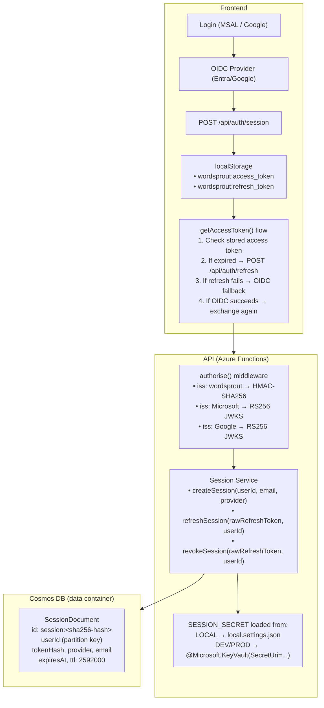
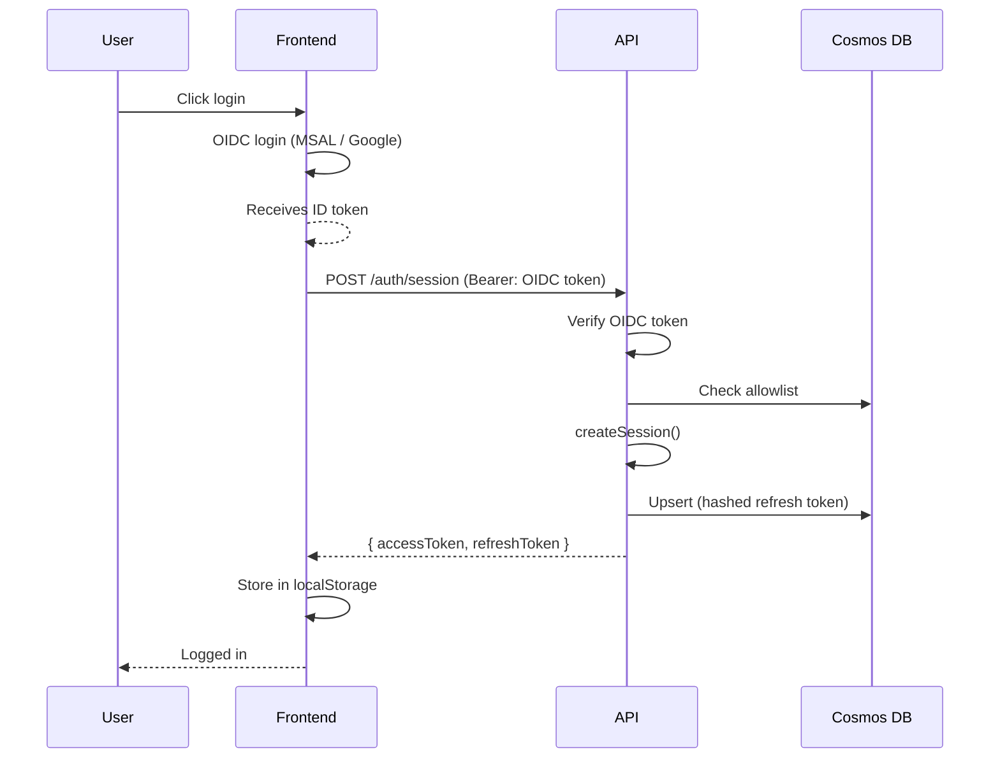
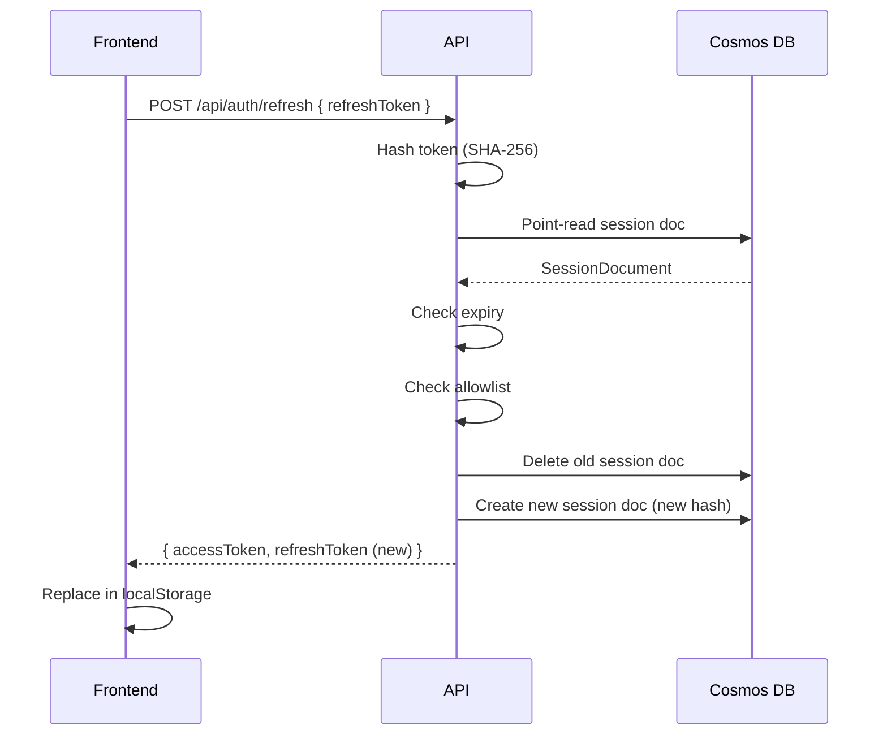
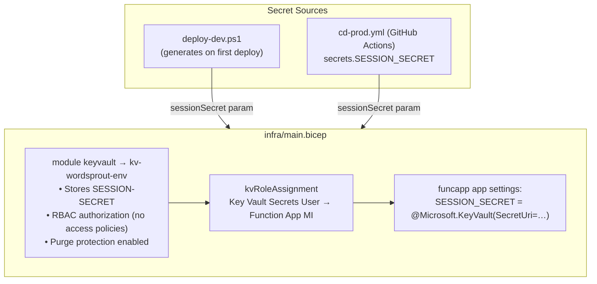

# Authentication & Session Management

This document describes WordSprout's authentication architecture, covering
OIDC login, backend session tokens, token refresh, and Key Vault integration.

---

## Overview

WordSprout uses a **two-layer authentication model**:

1. **OIDC login** (Microsoft Entra ID or Google) — proves the user's identity
2. **Backend session tokens** — issued by the API after OIDC verification, used
   for all subsequent API calls

This design eliminates the frequent re-login problem caused by short-lived OIDC
tokens (~1 hour) that cannot be silently refreshed on iOS PWA / Safari.

---

## Architecture Diagram



---

## Token Specifications

| Token | Format | Algorithm | Lifetime | Storage |
|-------|--------|-----------|----------|---------|
| Access token | JWT | HMAC-SHA256 | 15 minutes | localStorage (frontend) |
| Refresh token | 256-bit random (base64url) | — | 30 days | localStorage (frontend), SHA-256 hashed in Cosmos (backend) |

### Access Token Claims

```json
{
  "sub": "google:1234567890" or "abc-def-...",
  "email": "user@example.com",
  "provider": "microsoft" | "google",
  "iss": "wordsprout",
  "iat": 1716000000,
  "exp": 1716000900
}
```

---

## Auth Endpoints

| Method | Route | Purpose | Auth required |
|--------|-------|---------|---------------|
| `POST` | `/api/auth/session` | Exchange OIDC token for session pair | Bearer (OIDC) |
| `POST` | `/api/auth/refresh` | Rotate refresh token, get new pair | Body: `{ refreshToken }` |
| `DELETE` | `/api/auth/session` | Revoke a session (logout) | Body: `{ refreshToken }` |

---

## Login Flow (Sequence)



---

## Token Refresh Flow



---

## Session Expiry & Graceful Degradation

When a session expires and cannot be refreshed:

1. `getAccessToken()` returns `null`
2. `sync.ts` retries once with a fresh token before giving up
3. `wordsprout:session-expired` event is dispatched
4. `AuthProvider` clears session state → `AuthGuard` redirects to `/login`
5. The redirect preserves the PWA instance (no hard `window.location.replace`)

---

## Security Properties

- **Refresh token rotation**: Each refresh token is single-use. Using it creates a new pair and deletes the old one. If a stolen token is replayed after the legitimate user refreshes, it fails.
- **Hash-only storage**: Cosmos stores only SHA-256 hashes of refresh tokens. A database breach does not expose usable tokens.
- **TTL auto-cleanup**: Cosmos TTL (30 days) automatically deletes expired session documents.
- **Allowlist re-check on refresh**: Removed users cannot extend their session beyond the current access token lifetime (15 min max staleness).
- **Key Vault for signing secret**: `SESSION_SECRET` never appears in code, config files, or deployment logs. Only the Function App's managed identity can read it at runtime.

---

## Profile Picture

The user's provider profile photo is fetched client-side and displayed in the
avatar button in `UserMenu`. It is never stored in the backend session token or
the Cosmos `User` document.

### Google

The GIS ID token already contains a `picture` claim (a `https://lh3.googleusercontent.com/…`
URL) when the `profile` scope is requested. `googleAuth.ts` decodes this claim
inline — no extra network request is needed. The `img-src` CSP directive already
allows `https://lh3.googleusercontent.com`.

### Microsoft

The Entra ID token does not include a photo URL. Instead, the app fetches the
48×48 thumbnail from the MS Graph endpoint:

```
GET https://graph.microsoft.com/v1.0/me/photos/48x48/$value
Authorization: Bearer <User.Read access token>
```

- The access token is acquired silently via MSAL using the `User.Read` scope.
- The response binary blob is converted to a data URL and **cached in
  `localStorage`** under `wordsprout:ms_photo:{localAccountId}` for 24 hours.
- A 404 response (no photo set on the account) is treated as a graceful fallback
  — the avatar shows the email initial instead.
- The cache entry is cleared on logout.
- `connect-src` in `staticwebapp.config.json` includes `https://graph.microsoft.com`.

**Entra App Registration requirement**: the app registration must declare the
`Microsoft Graph → Delegated → User.Read` permission. `scripts/setup-entra-apps.ps1`
adds this automatically. Existing users will see a **one-time consent prompt** on
their next sign-in if they have not previously consented to `User.Read`.

---



The secret is generated **once** on first deploy. Subsequent deploys read the
existing value from Key Vault and pass it back (idempotent upsert).

---

## File Map

| File | Role |
|------|------|
| `api/src/services/session.ts` | Token creation, refresh, revocation |
| `api/src/functions/auth.ts` | Three HTTP endpoints |
| `api/src/middleware/authorise.ts` | Multi-provider JWT validation |
| `api/src/config/env.ts` | `SESSION_SECRET`, TTL config |
| `frontend/src/auth/sessionTokens.ts` | localStorage read/write helpers |
| `frontend/src/auth/useAuth.ts` | React hook for auth context |
| `frontend/src/auth/AuthProvider.tsx` | Session exchange, logout, picture state |
| `frontend/src/auth/googleAuth.ts` | Google JWT decode helpers incl. `picture` claim |
| `frontend/src/auth/msGraphAuth.ts` | MS Graph photo fetch + 24h localStorage cache |
| `frontend/src/services/api.ts` | `getAccessToken()` with session-first flow |
| `frontend/src/services/sync.ts` | 401 retry with refresh before `session-expired` |
| `frontend/src/main.tsx` | Global `session-expired` handler |
| `infra/modules/keyvault.bicep` | Key Vault + secret resource |
| `infra/main.bicep` | KV module + RBAC wiring |
