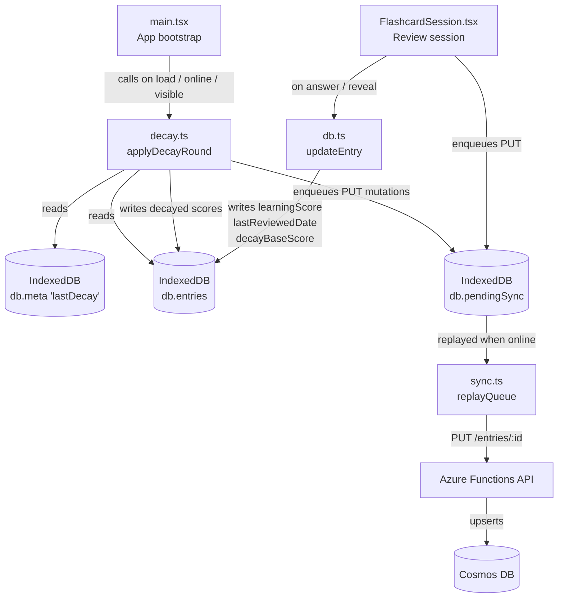
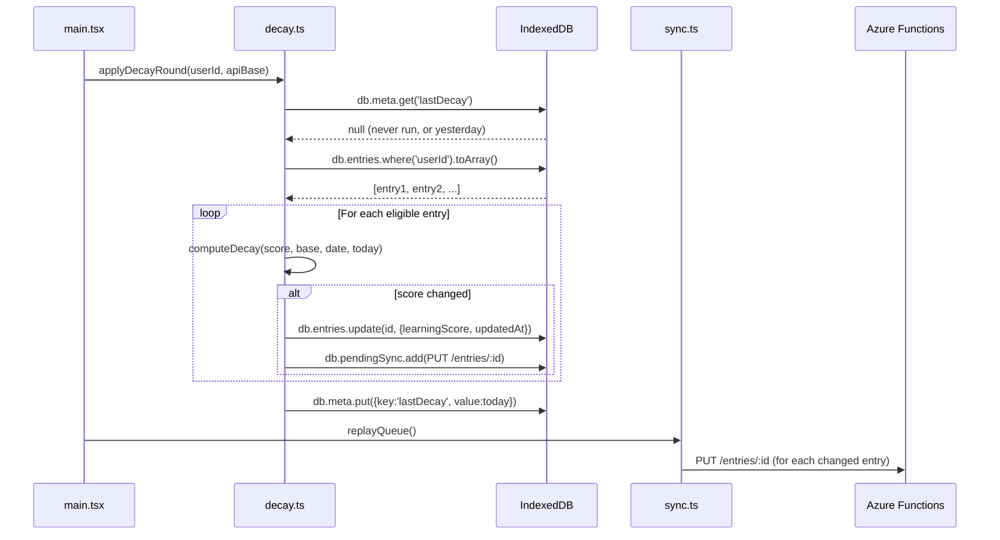
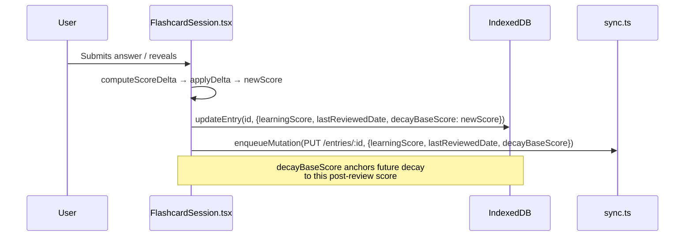

# Learning Score Decay

**Feature branch**: `feature/008-learning-score-decay`
**Spec**: [`specs/008-learning-score-decay/spec.md`](../specs/008-learning-score-decay/spec.md)

---

## Overview

Learning scores in WordSprout reflect how well the user knows a vocabulary entry. Without decay, a score earned months ago stays at its peak indefinitely — no longer reflecting the user's actual retention. This feature introduces **automatic progressive decay**: after a score-tier-based grace period, entries lose 1 point every 3 days of inactivity. Higher-scoring entries earn longer grace periods, rewarding mastery. The decay pass runs at most once per calendar day and requires no network access.

A **DecayBadge** on every entry card shows the user their current decay status at a glance — either a muted countdown during the grace period, or a colour-coded urgency pill once decay is active.

---

## Score Scale and Range Labels

Learning scores are integers from **0 to 100**, mapped to qualitative ranges:

| Score | Label | Meaning |
|---|---|---|
| 0–19 | Dormant | Never reviewed or fully forgotten |
| 20–39 | Sprouting | Beginning to take root |
| 40–59 | Echoing | Recognised but uncertain |
| 60–79 | Inscribed | Reliably recalled |
| 80–100 | Engraved | Deeply memorised |

Decay moves a score downward through these ranges when the entry hasn't been practised. Answering correctly in a review session moves it back up.

---

## Grace Period Tiers

The grace period before decay begins depends on the entry's score at the time of its last review (`decayBaseScore`). Higher scores earn more time:

| Score range | Label | Grace period |
|---|---|---|
| 0–19 | Dormant | 3 days |
| 20–39 | Sprouting | 5 days |
| 40–59 | Echoing | 7 days |
| 60–79 | Inscribed | 14 days |
| 80–100 | Engraved | 21 days |

The flat override `VITE_DECAY_GRACE_DAYS` (when set) bypasses the tier table and applies the same grace period to all entries — useful for local testing with `=0`.

---

## Decay Formula

```
grace            = graceForScore(decayBaseScore)   // tier table above
graceExpiredDays = max(0, daysElapsed − grace)
decayPoints      = floor(graceExpiredDays / DECAY_RATE_DAYS)
targetScore      = max(0, decayBaseScore − decayPoints)
newScore         = min(currentScore, targetScore)
```

| Parameter | Default | Source |
|---|---|---|
| `grace` | tier-based (3–21 days) | `graceForScore(decayBaseScore)` |
| `DECAY_RATE_DAYS` | `3` | `VITE_DECAY_RATE_DAYS` env var |
| `daysElapsed` | computed | Days between `lastReviewedDate` and today |

### Worked example (base score 80 = Engraved, grace 21 days, rate 3 days/point)

| Days since last review | Grace expired | Decay points | Target score |
|---|---|---|---|
| 0–21 | 0 | 0 | 80 |
| 24 | 3 | 1 | 79 |
| 27 | 6 | 2 | 78 |
| 51 | 30 | 10 | 70 |
| 261 | 240 | 80 | 0 |

---

## The `decayBaseScore` Field

The key design challenge is **multi-device idempotency**. A naïve formula — `currentScore − decayPoints` — fails when two devices each apply decay independently:

- Device A decays 100 → 98, syncs.
- Device B pulls 98 and re-applies −2 = **96** (wrong — double-decayed).

The fix: a dedicated `decayBaseScore` field, written once per review session, anchors the formula. Any device that receives the same `decayBaseScore` and `lastReviewedDate` computes the identical `targetScore`. Last-write-wins sync is therefore safe.

```
newScore = min(currentScore, max(0, decayBaseScore − decayPoints))
```

`decayBaseScore` is **only written during review sessions**, never during the decay pass itself.

---

## Data Model Changes

### `DBEntry` — new field

```typescript
decayBaseScore: number | null;
// Score at the time of the most recent review session completion.
// Anchors the decay formula so it is idempotent across devices.
// null = entry has never been reviewed in a session.
```

### `DBMeta` — new key

```
key: 'lastDecay'
value: 'YYYY-MM-DD'   // Local date of the last decay pass on this device
```

No Dexie schema version bump is needed — neither field is indexed.

---

## Architecture

### Component diagram



### Sequence: first open after inactivity



### Sequence: review session writes `decayBaseScore`



---

## Lifecycle Trigger Points

`applyDecayRound` is wired to three points in `main.tsx`, matching the existing pattern for `pullFromServer`:

| Event | Condition | Purpose |
|---|---|---|
| App bootstrap | `userId` + valid token present | Catches overnight decay on app open |
| `window: online` | Token present + `userId` resolved | Catches decay when coming back online |
| `document: visibilitychange` (→ visible) | Online + token present + `userId` | Catches decay on tab switch / device unlock |

The once-per-day guard (`db.meta 'lastDecay' === todayKey()`) ensures multiple triggers within the same calendar day are all no-ops after the first run.

---

## Skip Conditions

An entry is **not decayed** when any of the following are true:

- `learningScore === 0` — already at floor
- `decayBaseScore === null` — never been reviewed; no anchor to decay from
- `lastReviewedDate === null` — no reference date to compute elapsed days
- `daysElapsed ≤ graceForScore(decayBaseScore)` — still within the tier-based grace period

---

## Decay Status and UI Badges

`getDecayStatus(decayBaseScore, currentScore, lastReviewedDate, today)` returns a `DecayStatus` discriminated union used by `DecayBadge` to render an inline indicator on every collapsed entry card:

| `kind` | Condition | Badge appearance |
|---|---|---|
| `none` | Never reviewed (`decayBaseScore === null`) | Nothing rendered |
| `grace` | Within grace period | Muted pill: `🕐 Nd left` |
| `decaying` | Grace expired | Coloured pill: `↓ −N pts` |

Active decay urgency is based on percentage of `decayBaseScore` lost:

| Urgency | Threshold | Colour |
|---|---|---|
| `low` | < 15% lost | Amber |
| `medium` | 15–35% lost | Orange |
| `high` | ≥ 35% lost | Red |

---

## Key Source Files

| File | Role |
|---|---|
| [`frontend/src/services/scoring.ts`](../frontend/src/services/scoring.ts) | `graceForScore()` tier table; `computeDecay()` pure function; `getDecayStatus()` + `DecayStatus` type; `DECAY_RATE_DAYS` constant |
| [`frontend/src/services/decay.ts`](../frontend/src/services/decay.ts) | `applyDecayRound()` orchestrator — once-per-day pass |
| [`frontend/src/services/db.ts`](../frontend/src/services/db.ts) | `DBEntry.decayBaseScore` field; `DBMeta` `'lastDecay'` key |
| [`frontend/src/components/entry/DecayBadge.tsx`](../frontend/src/components/entry/DecayBadge.tsx) | Visual decay status badge on each entry card (grace countdown / urgency pill) |
| [`frontend/src/components/review/FlashcardSession.tsx`](../frontend/src/components/review/FlashcardSession.tsx) | Writes `decayBaseScore` alongside `learningScore` on every review answer |
| [`frontend/src/main.tsx`](../frontend/src/main.tsx) | Wires `applyDecayRound` to app lifecycle events |

---

## Environment Variable Overrides

Override these in `frontend/.env.local` to speed up testing:

```sh
# Override ALL grace tiers with a flat value (e.g. 0 = decay starts immediately).
# When unset, the tier table is used (Dormant=3d … Engraved=21d).
VITE_DECAY_GRACE_DAYS=0

# Lose 1 point per day instead of 1 per 3 days
VITE_DECAY_RATE_DAYS=1
```

`VITE_DECAY_RATE_DAYS` defaults to `3` when unset or invalid. `VITE_DECAY_GRACE_DAYS` has **no default** — when unset, `graceForScore()` uses the tier table.
